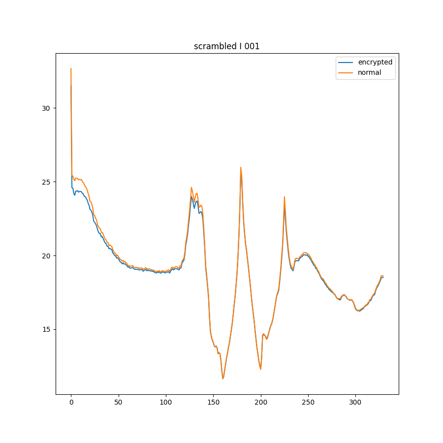

# Dec 6

---

# 1

---

# What I did

iPhone で撮影し、
HEVC コーデックで圧縮された動画を未圧縮の状態に伸長した。
その後各フレームごとに暗号化を施し、H264 で圧縮した。
(preset: veryfast, crf: 35, I frame inverval: 1 or 120)
それぞれの条件で、通常通り圧縮した動画との PSNR を比較した。

---

---

---

---

---

---

---

# Result

動画であっても、I フレームの間隔を広くとっても、
壊滅的な質の劣化は確認されなかった。
しかし、ブロックの境目は顕著に現れており、
画像ほどナチュラルに復号化するには至らなかった。

---

# Issue

今回、動画 1 本を通して同じパターンで暗号化したが、
フレームごとにパターンを変えてみるとどうなるのか興味を惹かれる。
今後の課題としたい。

---

